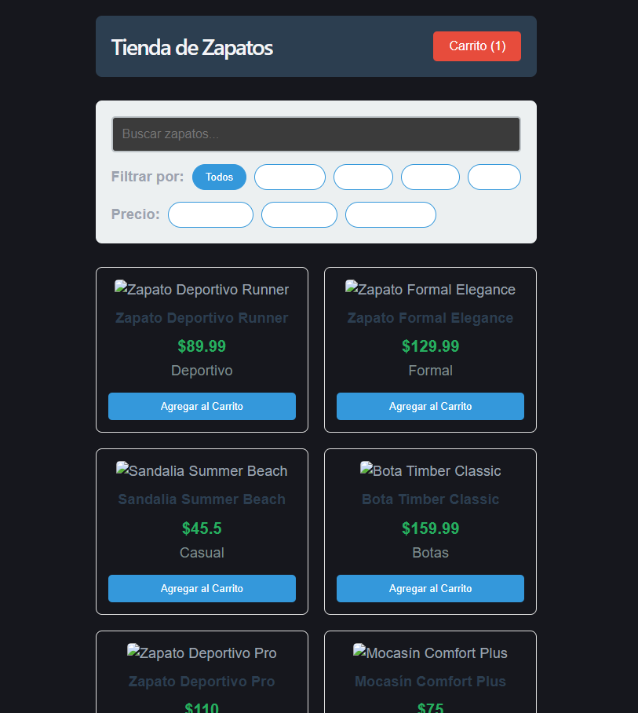
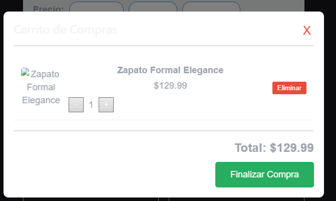
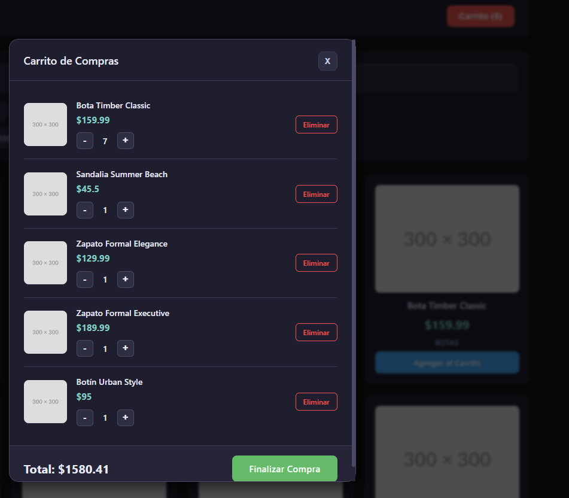
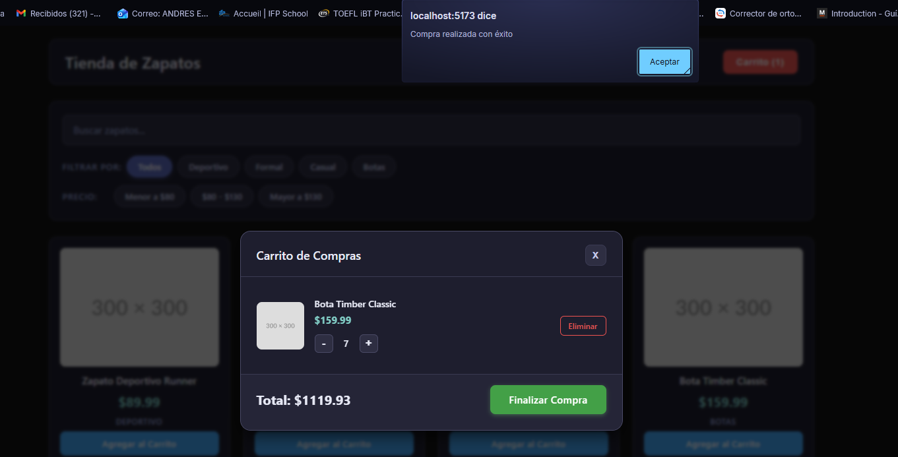
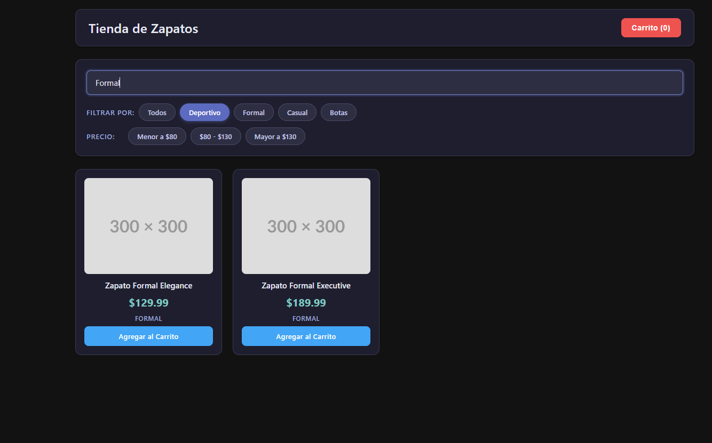
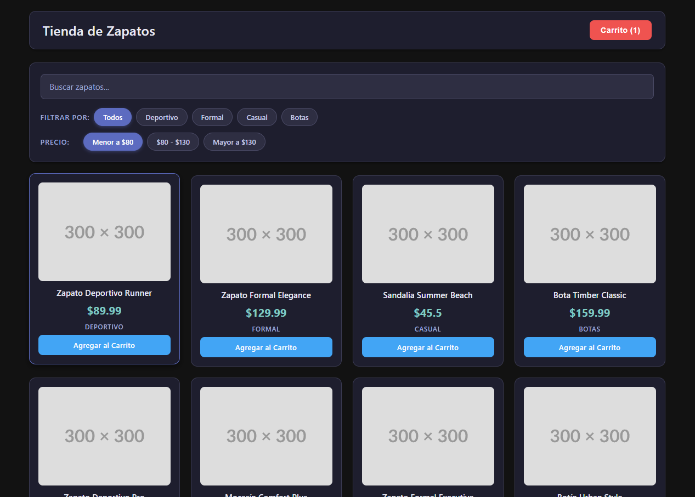
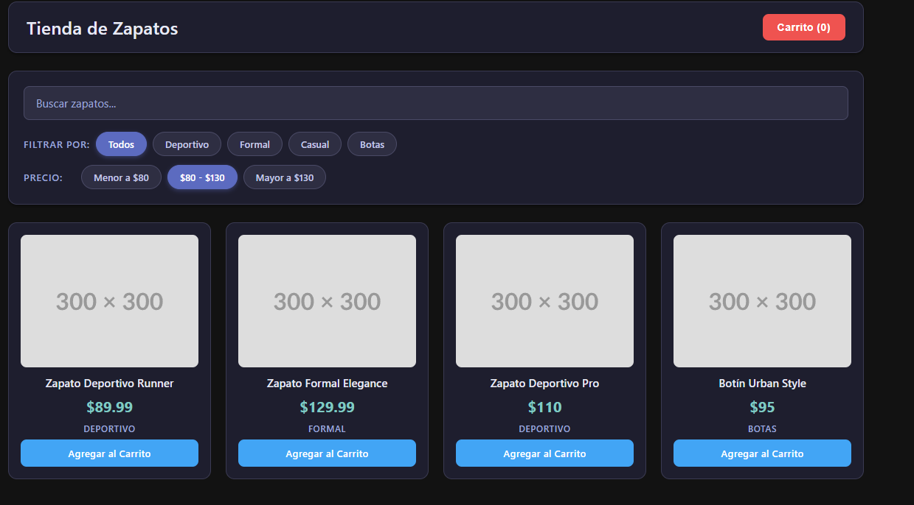

# Tienda de Zapatos - Proyecto React

## Descripción del Sistema

Tienda de Zapatos es una aplicación web de comercio electrónico desarrollada en React que permite a los usuarios explorar un catálogo de productos, filtrarlos por categoría y precio, buscar productos específicos y gestionar un carrito de compras.

## Características

- Visualización de catálogo de productos
- Filtrado por categoría (Deportivo, Formal, Casual, Botas)
- Filtrado por rango de precio
- Búsqueda de productos por nombre
- Carrito de compras funcional
- Total dinámico del carrito

## Estructura del Proyecto

```
tienda-zapatos/
├── src/
│   ├── components/
│   │   ├── ProductCard.jsx
│   │   ├── ShoppingCart.jsx
│   │   ├── FilterBar.jsx
│   │   └── SearchBar.jsx
│   ├── App.jsx
│   ├── App.css
│   ├── main.jsx
│   └── index.css
├── package.json
└── vite.config.js
```

## Instrucciones de Instalación

1. Asegúrate de tener Node.js instalado (versión 18+)
2. Clona o descarga el proyecto
3. Instala las dependencias:
   ```bash
   npm install
   ```
4. Inicia el servidor de desarrollo:
   ```bash
   npm run dev
   ```
5. Abre tu navegador en http://localhost:5173

## Objetivo Académico

Este proyecto fue creado como ejercicio práctico para la materia "Configuración y Mantenimiento de Software". El objetivo es que los estudiantes identifiquen y corrijan errores de diferentes tipos:

- Errores de lógica en el código
- Malas prácticas de desarrollo
- Problemas de estructura de componentes
- Errores en el manejo de estados
- Problemas de rendimiento
- Código duplicado
- Nombres de variables poco claros
- Manejo incorrecto de props
- Falta de validaciones
- Problemas de estilos

## Tecnológico

- React 18
- Vite (herramienta de build)
- Hooks (useState, useEffect)
- CSS básico

---

**Nota para estudiantes**: El sistema contiene errores intencionales que deben ser identificados y corregidos. ¡Éxito en tu evaluación!

---

# Resolviendo parcial:

## Problemas de estilos:

### Filtros no se pueden leer si no estan seleccionados



### Carrito de compras ilegible



#### Solucion propuesta:

Se plantea una tableta nueva de estilos siguiendo los principios de material design manteniendo los colores azul y gris como principales

### Problemas de imagenes:

#### Solucion propuesta

El recurso de imagenes que se estaba usando esta obsoleto, se cambia por el servicio actualizado

## Problemas de logica en el codigo

### Precio total de los items se recalcula cada que se abre el shopping cart pero no si se agregan mas items del mismo producto desde el, no se esta usando el prop total que ya recibe el componente



#### Solucion propuesta

- Eliminar useState(cartTotal) y useEffect con dependencia vacía
- El total se calculaba solo al montar el componente, ignorando cambios
- Usar el prop `total` que llega desde App.jsx en lugar de recalcular

### El carrito nunca se vaciaba visualmente al finalizar la compra, se esta mutando el prop cart en checkout (lo cual viola principios de react)



#### Solucion propuesta

- Agregar prop onCheckout y función clearCart en App.jsx

### El filtro de busqueda y el de categoria se sobreponen, es decir cuando se filtra por categoria y luego se busca el de busqueda toma prioridad e ignora el de categoria



#### Solucion propuesta

- Unificar en un solo useEffect con dependencias [filter, searchTerm]

### Use state que nunca se usa presente en el codigo causando renderizados innecesarios

#### Solucion propuesta

- Eliminarlo

### Filtro de precio no hace nada



#### Solucion propuesta

- Conectar filtro de precio con el estado de App.jsx
- Convertir a componente controlado con props selectedPrice/onPriceChange

### Funciones internas duplicadas e inutilizadas

#### Solucion propuesta

- Eliminarlas

### Filtro de precio sin opción de resetear

Una vez seleccionado un rango de precio no había forma de volver a ver todos los productos.


#### Solución propuesta

- Agregar botón "Todos" al filtro de precio consistente con el filtro de categorías

### Contador del carrito incorrecto

El botón del carrito mostraba el número de productos distintos en lugar de la cantidad total de unidades.

#### Solución propuesta

- Reemplazar cart.length por un reduce que sume todas las quantities de los items

## Malas practicas de desarrollo

### Console log en produccion

Existe un console log en app.jsx que se olvido eliminar

#### Solucion propuesta

- Eliminarlo

### Data hardcodeada en archivo app.jsx

Existe un array de data hardcodeada en el archivo app.jsx lo cual es una mala practica

#### Solucion propuesta

- Crear una nuevo archivo que contenga `products.js` la data con la direccion:

```
├── src/
│   ├── data/
│   │   ├── products.js
```

### Ningún componente valida sus props

Al no validar los props si se pasa un prop incorrecto o faltante React no avisa nada los errores aparecen silenciosamente en runtime

#### Solucion propuesta

- Installar PropTypes
- Agregar validación de props con PropTypes en todos los componentes

### Funciones intermedias innecesarias

handleFilterChange, handlePriceFilter y handleClick solo reenviaban llamadas

#### Solucion propuesta

- Reemplazar por llamadas directas al prop en el evento onClick

### Estado duplicado con el padre en SearchBar

SearchBar no necesita recordar el valor, eso ya lo hace App.jsx

#### Solucion propuesta

- Convertir a componente controlado con prop value

## Problemas de estructura de componentes

### Lógica de filtrado dentro del componente app.jsx

App debería ocuparse solo de coordinar la UI Si la lógica crece, el componente se vuelve difícil de mantener y probar

#### Solucion propuesta

- Crear useProductFilter.js con estados y useEffect en la ruta:

```
├── src/
│   ├── hooks/
│   │   ├── produuseProductFiltercts.js
```

- App.jsx se enfoca solo en coordinar la UI

### Lógica del carrito mezclada con la UI

Igual que el filtrado, toda la lógica del carrito vive dentro de App — addToCart, removeFromCart, updateQuantity, clearCart, getTotal son lógica de negocio que no pertenece al componente de UI

#### Solucion propuesta

- Crear useCart.js en la ruta:

```
├── src/
│   ├── hooks/
│   │   ├── useCart.js
```

- App.jsx queda enfocado exclusivamente en la UI

## Problemas de manejo de estados

### En usecart las actualizaciones de estado estan basadas en estado anterior

Usar el estado directamente en las actualizaciones es un anti-patrón. En React, múltiples llamadas seguidas pueden leer un estado desactualizado porque el estado no se actualiza de forma síncrona

#### Solucion propuesta

- Usar forma funcional del setter para actualizaciones de estado

### En usecart getTotal recalcula en cada render

getTotal es una función que se recrea en cada render y recalcula el total desde cero cada vez que se llama Si el carrito tiene muchos items y el componente re-renderiza frecuentemente este cálculo se repite innecesariamente

#### Solucion propuesta

- Reemplazar getTotal por useMemo para evitar recálculos

### Estado products es derivado en useProductFilter

Products no es un estado independiente, es siempre una versión filtrada de productData, tener dos fuentes de verdad (productData + products) es un anti-patrón

#### Solucion propuesta

- Reemplazar useState+useEffect por useMemo para productos filtrados

## Problemas de rendimiento

### Componentes se re-renderizan innecesariamente

Cada vez que App re-renderiza, React vuelve a renderizar ProductCard, FilterBar y SearchBar aunque sus props no hayan cambiado Por ejemplo: abrir/cerrar el carrito (showCart) causa que toda la lista de productos se re-renderice innecesariamente

#### Solucion propuesta

- memo en los componentes
- useCallback en las funciones que se pasan como props

### ShoppingCart no se desmonta al cerrar

ShoppingCart solo se monta/desmonta según showCart pero mientras está abierto, cualquier cambio en App (agregar producto, cambiar filtro) lo re-renderiza completo incluyendo el map de todos los items

#### Solucion propuesta

- Evitar re-renders innecesarios con memo

### setSearchTerm pasado directamente como prop en App.jsx

setSearchTerm se pasa directamente, aunque es estable, es una práctica que acopla SearchBar directamente al setter del hook, dificultando agregar lógica futura como debounce

#### Solucion propuesta:

- Agregar debounce al filtrado por búsqueda

## Falta de validaciones

### No se valida el stock al agregar productos

Se puede agregar un producto al carrito sin límite aunque el stock sea 5 y ya tengas 5 en el carrito puedes seguir agregando indefinidamente

#### Solucion propuesta:

- Validar stock disponible al agregar productos al carrito

### No hay feedback visual cuando se alcanza el stock

El botón "Agregar al Carrito" siempre se ve igual aunque el producto ya no tenga stock disponible el usuario no sabe por qué no puede agregar más.

#### Solucion propuesta:

- Deshabilitar botón al alcanzar stock máximo

### No hay confirmación antes de eliminar un item

Al hacer click en "Eliminar" el producto desaparece inmediatamente sin ninguna confirmación, fácil de hacer por accidente

#### Solucion propuesta:

- Agregar confirmación antes de eliminar item del carrito

### No hay confirmación antes de finalizar la compra

Al hacer click en "Finalizar compra" la compra se ejecta sin ninguna confirmación, fácil de hacer por accidente

#### Solucion propuesta:

- Agregar confirmación antes de finalizar compra item del carrito

## Codigo duplicado y nombres de variables poco claras

### Lógica de filtro de precio repetida

La lógica de los rangos de precio está definida una sola vez en useProductFilter.js, lo que está bien. Pero los rangos (< 80, >= 80 && <= 130, > 130) que si cambian habría que buscarlos manualmente.

#### Solucion propuesta

- Centralizar rangos de precio en PRICE_RANGES

### Las categorías están definidas en dos lugares

Si se agrega una categoría nueva en products.js hay que acordarse de actualizarla también en FilterBar.jsx

#### Solucion propuesta

- Derivar categorías desde productData en lugar de hardcodearlas

### El valor inicial "all" del filtro de precio repetido

Se usa en varias partes hardcodeado como "all"

#### Solucion propuesta

- Extraer valor inicial del filtro de precio a constante

### acc en los reduce

acc es poco diciente

#### Solucion propuesta

- Darle otro nombre como total

### cat en el map de categorías

cat es poco diciente

#### Solucion propuesta

- Darle otro nombre como Category
